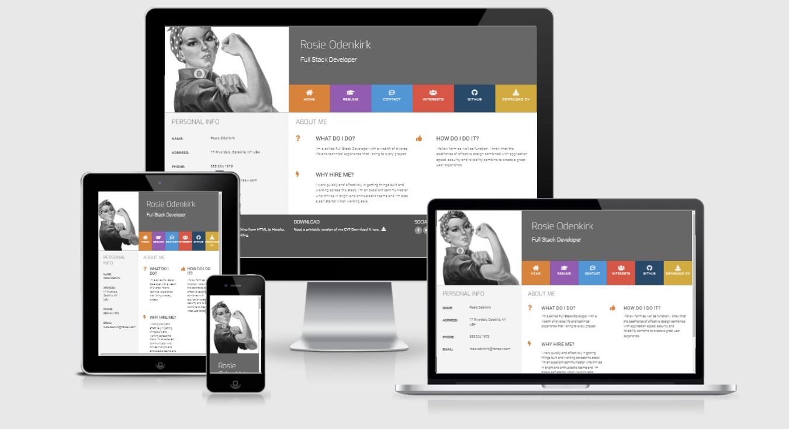

# Fictious Rosie's Resume

A project created via Code Institute as part of the Full Stack Diploma in Software Development. The project goal was to put into practice knowledge of Bootstrap framework and using JavaScript and jQuery, both to manipulate the DOM and to make Ajax calls to the Google Maps, GitHub, and email service APIs.

[Link to deployed website](https://aleksandracodes.github.io/resume-project-bootstrap/)

